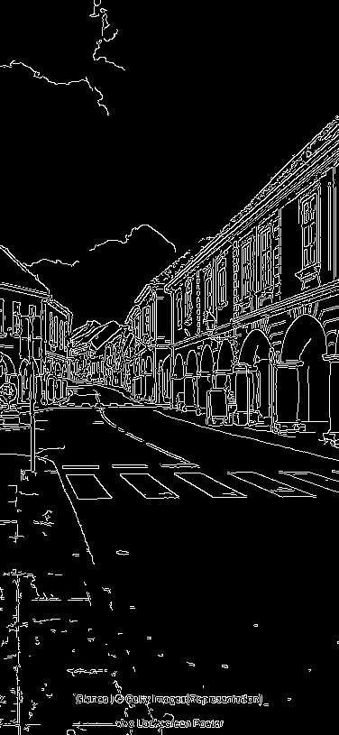
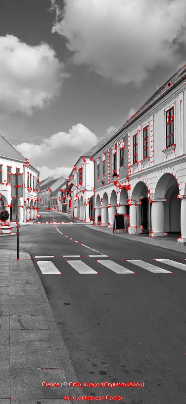
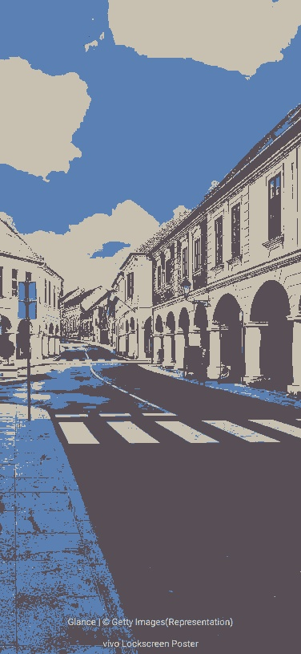
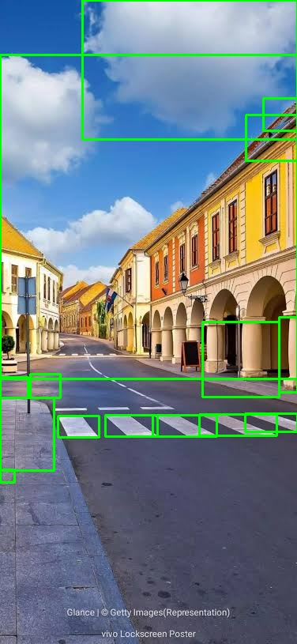

# Smart Image Analyzer & Object Segmentation System

## 1. Project Overview

Smart Image Analyzer & Object Segmentation System is a Python-based computer vision application that analyzes a single input image using multiple image processing and computer vision techniques.

The system performs image enhancement, edge and feature detection, image segmentation, object analysis, and automatic report generation.

The project is designed as a modular pipeline where each major computer vision operation is implemented in a separate Python module.

---

## 2. Features

### Image Enhancement

- Grayscale conversion
- Gaussian filtering
- Histogram generation
- Histogram equalization

### Edge and Feature Detection

- Canny edge detection
- Harris corner detection
- Hough line detection

### Image Segmentation

- Threshold-based segmentation
- K-Means segmentation

### Object Analysis

- Contour detection
- Bounding box generation
- Object area calculation
- Object counting

### Report Generation

- Automatic JSON report
- Image dimensions
- Number of detected objects
- Object information
- Computer vision techniques used

---

## 3. Technologies Used

- Python
- OpenCV
- NumPy
- Matplotlib
- Scikit-learn
- Pytest

---

## 4. Project Structure

```text
SmartImageAnalyzer/
│
├── docs/
│   ├── architecture.md
│   ├── class_diagram.md
│   ├── requirements.md
│   ├── sequence_diagram.md
│   ├── use_case.md
│   └── workflow.md
│
├── input/
│   └── sample.jpg
│
├── outputs/
│
├── src/
│   ├── __init__.py
│   ├── image_utils.py
│   ├── enhancement.py
│   ├── edge_detection.py
│   ├── segmentation.py
│   ├── object_analysis.py
│   └── report.py
│
├── tests/
│   ├── __init__.py
│   └── test_project.py
│
├── main.py
├── requirements.txt
├── statement.md
├── README.md
└── .gitignore

```
---
---

## 5. Sample Results

The system generates separate outputs for each computer vision technique.

### Grayscale Conversion

Converts the original color image into a grayscale image.


### Canny Edge Detection

Detects significant edges in the image.



### Harris Corner Detection

Identifies corner features present in the image.



### K-Means Segmentation

Groups image pixels into three clusters based on their color values.



### Object Analysis

Detects contours from the threshold-segmented image and generates bounding boxes around sufficiently large detected regions.



### Other Generated Results

The system also generates:

- Gaussian-filtered image
- Histogram
- Histogram-equalized image
- Hough line detection
- Threshold segmentation
- JSON analysis report

---

## 6. Testing Results

The project was tested using Pytest.

The current test suite contains 11 automated tests covering:

- Image loading
- Grayscale conversion
- Gaussian filtering
- Histogram equalization
- Canny edge detection
- Harris corner detection
- Hough line detection
- Threshold segmentation
- K-Means segmentation
- Object analysis

All 11 tests passed successfully.

```text
11 passed

```
---

## 7. Installation

### Clone the Repository

```bash
git clone https://github.com/RashiGarg727/SmartImageAnalyzer.git
```

### Open the Project Folder

```bash
cd SmartImageAnalyzer
```

### Create a Virtual Environment

```bash
python -m venv venv
```

### Activate the Virtual Environment

On Windows:

```bash
venv\Scripts\activate
```

### Install Required Libraries

```bash
pip install -r requirements.txt
```

---

## 8. Running the Project

Place the input image inside:

```text
input/
```

The image should be named:

```text
sample.jpg
```

Then run:

```bash
python main.py
```

The program automatically creates the `outputs` folder if it does not already exist.

After successful execution, the system generates processed images and a JSON analysis report inside the `outputs` folder.

---

## 9. Running Tests

Run the following command:

```bash
pytest
```

The current test suite contains 11 automated tests.

Expected result:

```text
11 passed
```

---

## 10. Error Handling

The system checks whether:

- The input image exists.
- The input image can be read successfully.
- Processed images can be saved successfully.

If an input or output operation fails, an appropriate error message is displayed.

This prevents the application from continuing with an invalid input image.

---

## 11. Documentation

Additional project documentation is available in the `docs` folder.

The documentation includes:

- System architecture
- System workflow
- Functional and non-functional requirements
- Use case diagram
- Class/component diagram
- Sequence diagram

These documents describe the design and workflow of the system in detail.

---

## 12. Future Enhancements

Possible future improvements include:

- Support for multiple input images
- Automatic threshold selection
- More advanced object detection
- Real-time video processing
- Graphical user interface
- More detailed image analysis reports